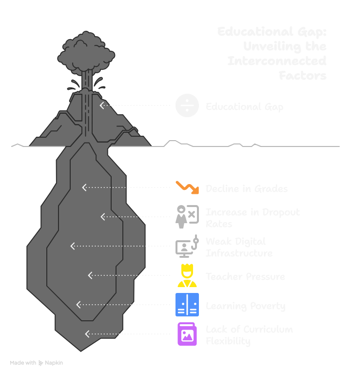
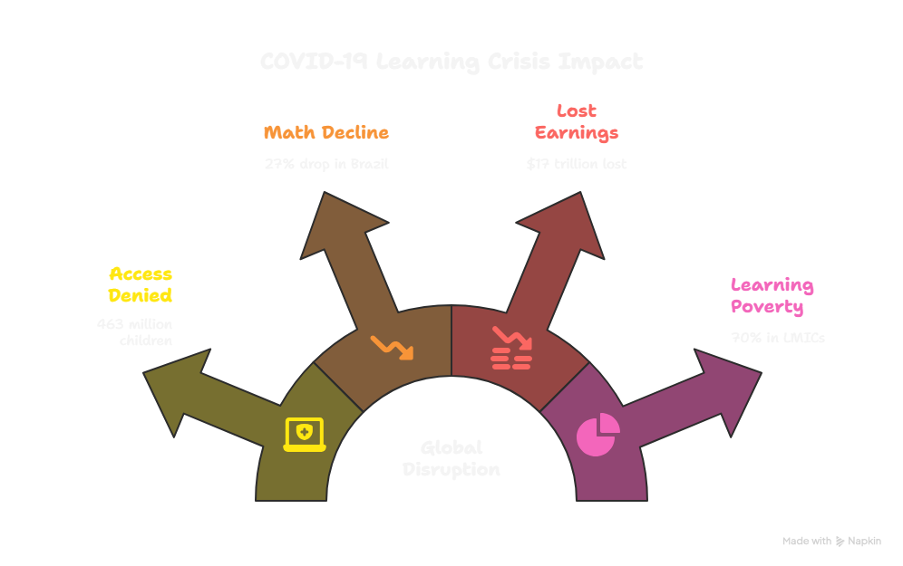
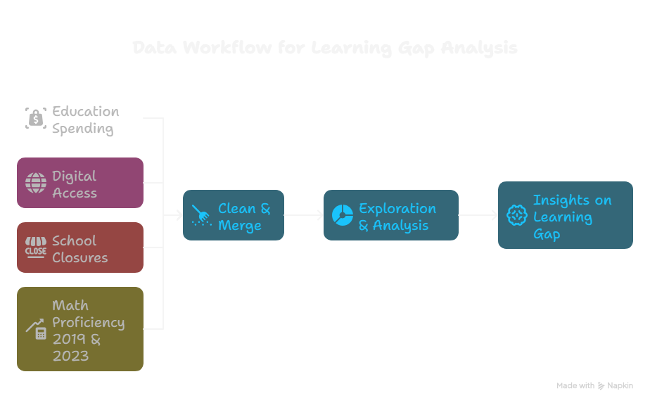

# 📊 Mathematics After COVID-19

## 🧠 Project Overview

This project aims to analyze and understand the global gap in mathematics
 proficiency among primary school students before and after the COVID-19 pandemic.
  The work focuses on comparing learning outcomes between 2019 and 2023 and
   exploring the possible role of factors such as:

- School closures  
- Education spending  
- Digital connectivity  
- Access to trained teachers

---

## 🎯 Goals

- Quantify the change in math proficiency across countries.  
- Identify patterns and factors that may have contributed to the learning gap.  
- Provide insights through visualizations and models to better understand
   the educational impact of the pandemic.

---

## Team understanding of the learning problem after the COVID-19 pandemic

---

## 🔍 What We Did

- Collected and combined data from multiple international sources.  
- Focused on comparing math proficiency before (2019) and after (2023)
   the pandemic.  
- Investigated possible explanations for the learning gap,
   such as school closures, access to technology, and education spending.

---

## 💡 Key Questions

- How much did math proficiency change during the pandemic?  
- Which countries or regions were most affected?  
- What factors are most strongly associated with greater learning loss?

---

## 📈 Key Results

- Over 1.6 billion learners worldwide experienced educational disruption, with 463 million children unable to access remote learning.
- Field studies documented sharp declines in mathematics proficiency, including a >27% drop for Brazilian second graders and regression to pre‑primary skill levels in Kenya and Uganda.
- The affected cohort may face up to $17 trillion in lost lifetime earnings, and learning poverty in low- and middle-income countries could reach 70%.
- Structural issues like weak digital infrastructure, teacher burnout, and inflexible curricula deepened the gap.
- Country data show divergent paths between 2019 and 2023: Albania and Armenia improved, while Australia, Azerbaijan, and Belgium declined.

---

## 🔄 Reproducibility

All data preparation and analysis steps are reproducible through the scripts
 provided in the repository.  
Please refer to the folders for each phase of the project
 (data preparation, exploration, and analysis).

---

## 📌 Project Flow Diagram

*Diagram showing the data flow and analysis process to explore the
 math learning gap post-COVID.*

---

## 👥 Team

Our team brings diverse perspectives from teaching, data analysis, and lived experience:

- [__Heba Abudahrouj__](https://github.com/heba3)
- [__MD Jubayer Khan__](https://github.com/MD-Jubayer-Khan)
- [__Nada Saed__](https://github.com/Nada-saad635)
- [__MayMon__](https://github.com/MayMon-T3807)
- [__Alexander Andom__](https://github.com/aandom)
- [__Momtaz Yaqubic__](https://github.com/Momtaz-yaqubi)

---

## 🤝 Acknowledgments

This work is part of an academic data science initiative focused on
 understanding global development challenges using real-world data.

---
